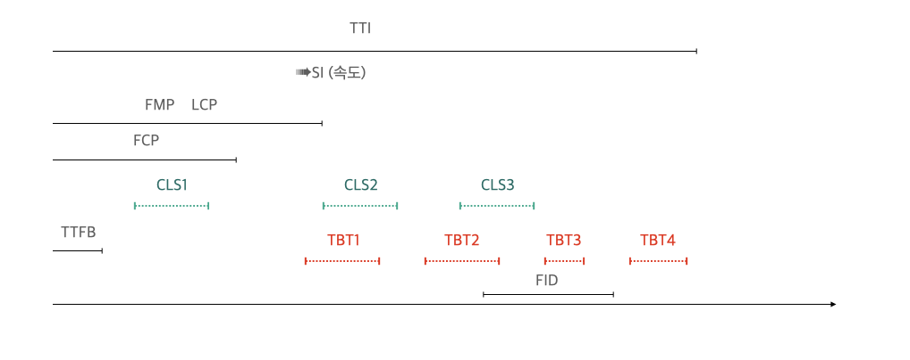

**목차**
- [리액트 라이프사이클에 대해](#리액트-라이프사이클에-대해)
- [useMemo 는 어떤 hooks이고, 언제 사용하나요?](#useMemo는-어떤-hooks이고,-언제-사용하나요?)

 
 

## 웹페이지 성능 최적화를 한다면 어떻게 할건가요
-----
일단 프론트에서 웹서비스에서 성능 측정의 구분을 크게 2개로 봐야합니다.

- 로딩 성능
	- 서버에 있는 웹 리소스를 다운로드 할 때의 성능을 말합니다.
		- 리로스 크기, 개수 최적화
		- 코드 분할
		- 리소스 우선순위
- 랜더링 성능
	- 다운로드한 리소스를 가지고 화면을 그릴 때의 성능을 말합니다.
		- 브라우저 동작원리
		- 프레임워크 라이프 사이클

만약 웹서비스 전체로 파악한다면 더 다양한 영역들이 있습니다. 너무 깊게 가진않고 나열만 해볼게요.

 
 

#### TTFB, FCP, SI, LCP,  FMP, TTI, TBT, CLS는 무엇인가요
------
여러 요소로 웹페이지 성능 측정을 하는데요. 각 위치마다 최적화를 위한 방법들이 다릅니다. 하지만 모든걸 할 수 없다면 전체 Perfomance에서 미치는 각각의 가중치들이 있습니다. 이를 우선순위로 삼아서 접근하는 것도 방법일 것 같습니다.

가중치가 가장 높은 3가지는 LCP, TBT, CLS 입니다.

TTFB
- 서버에서 바이트가 도착하는 시점을 나타낸다.
- 서버 성능과 관련있다.
 

FCP
- 페이지가 로드 될때 브라우저가 DOM 콘텐츠의 첫 번째 부분을 렌더링 하는데 걸리는 <U>시간</U>
- 10% 가중치
- 최적화 방법
	- 렌더링을 block 하는 리소스 제거
	- CSS minify
	- 사용하지 않는 CSS 제거
	- 요청할 origin에 preconnect : `<link rel="preconnect">`
	- 서버 응답 시간 (TTFB) 줄이기
	- 여러 페이지 리다이렉트 줄이기
	- 키 요청 preload : `<link rel="preload">`
	- 지나치게 큰 네트워크 payload를 피하기
	- 효율적인 캐시 정책으로 정적 자산 제공
	- 과도한 DOM size를 피하기
	- 중요한 요청의 depth를 최소화
	- 웹 폰트 로드 중에 텍스트가 계속 보이도록 함
	- 요청 수를 줄이고 전송 크기를 작게 하기
 

SI
- 페이지 로드 중 콘텐츠가 시각적으로 표시되는 **<u>속도</U>**
- 10% 가중치
 

FMP
- 페이지의 주요 컨텐츠들을 화면에 렌더링하기 시작하는 <U>순간</U>
 

⭐️⭐️ LCP
- 페이지가 로드될 때 화면내에 가장 큰 이미지나 텍스트 요소가 렌더링 되기까지 걸리는 <U>시간</U>
- 25% 가중치
- 최적화 방법
	- 느린 서버 응답 시간 해결
	    - 서버 최적화
	    - 가까운 CDN으로 라우팅
	    - asset 캐싱
	    - cache-first HTML 페이지 서빙
	    - 서드파티 origin 리소스 preconnect
	- 렌더링을 block 하는 JS 및 CSS 해결
	    - CSS block 시간 단축
	    - CSS minify
	    - 중요하지 않은 CSS는 defer로 load
	    - 중요 CSS는 inline 으로 load
	- Javascript block 시간 단축
	    - JS 파일 minify 및 압축
	- 느린 리소스 (img, svg, video, ...) 로드 시간 해결
	    - 이미지 최적화 및 압축
	    - 중요한 리소스 preload
	    - 텍스트 파일 압축
	    - 적응형 리소스 서빙
	        - 예: 네트워크가 느린 경우 video 대신 image 서빙
	    - 서비스 워커를 통한 자산 캐싱
	- 클라이언트 사이드 렌더링의 경우
	    - 중요한 자바스크립트 최소화
	    - 자바스크립트 minify
	    - 사용하지 않는 자바스크립트 defer로 load
	    - 사용하지 않는 polyfill 최소화
	- 서버사이드 렌더링 사용
	        - `TTFB` 증가, `TTI` 증가를 고려해야 함
	- pre-rendering 사용
	        - `TTI`는 증가할 수 있으나 `TTFB`는 `SSR`보다 나음

TTI
- 사용자가 페이지와 상호작용이 가능한 시점까지 걸리는 <U>시간</U>
- 10% 가중치
- 최적화 방법
	- JS minify
	- 요청할 origin에 preconnect : `<link rel="preconnect">`
	- 키 요청 preload : `<link rel="preload">`
	- 타사 코드의 영향 범위 감소
	- 중요한 요청의 depth를 최소화
	- JS 실행시간 단축
	- 메인 스레드 작업 최소화
	- 요청 수를 줄이고 전송 크기를 작게 유지

⭐️⭐️ TBT
- FCP - TTI 시간동안, 페이지가 클릭, 키보드 입력 등의 사용자 입력에 응답하지 않도록 차단된 총 <U>시간</U>
- 30% 가중치
- 최적화 방법
	- 타사 코드의 영향 범위 감소
	- JS 실행시간 단축
	- 메인 스레드 작업 최소화
	- 요청 수를 줄이고 전송 크기를 작게 유지
 

⭐️⭐️ CLS
- 페이지가 로드과정에서 발생하는 예기치 못한 모든 <U>레이아웃 이동</U>의 누적점수를 측정
- 레이아웃 이동 == 화면상에서 요소의 위치나 크기가 순간적으로 변하는 현상
- 15% 가중치
- 최적화 방법
	- JS minify
	- 요청할 origin에 preconnect : `<link rel="preconnect">`
	- 키 요청 preload : `<link rel="preload">`
	- 타사 코드의 영향 범위 감소
	- 중요한 요청의 depth를 최소화
	- JS 실행시간 단축
	- 메인 스레드 작업 최소화
	- 요청 수를 줄이고 전송 크기를 작게 유지
 

⭐️⭐️ FID
- 사용자가 페이지와 처음 상호작용한 시간부터 브라우저가 실제로 이벤트 핸들러 처리를 시작할 수있는 시간까지의 <U>시간</U>
- 최적화 방법
	- 긴 Tasks 분할하기
	    - 메인 스레드를 50ms 이상 차단하는 긴 Task를 분할하기 (`TBT` 개선)
	    - 코드 스플리팅
	- 상호작용 준비를 위한 페이지 최적화
	    - JS 코드 및 기능을 점진적으로 load
	    - SSR의 경우 논리를 서버측으로 이동하고 코드 스플리팅을 고려해야 함
	    - cascading data fetch를 최소화
	    - 서드파티 코드 로딩시간 고려해야 함
	- web worker 사용하기
	    - 백그라운드 스레드에서 자바스크립트를 실행할 수 있음
	- JS 실행시간 단축
	    - 사용하지 않는 자바스크립트 defer로 load
	        - 특별한 이유가 없는 한 서드파티 스크립트는 defer 또는 async로 로드되어야 함
	    - 사용하지 않는 polyfill 최소화
	        - module / nomodule 패턴을 활용하여 개별 번들 제공

<b>참고자료</b>

	<a href="https://velog.io/@yrnana/%EC%9B%B9%EC%82%AC%EC%9D%B4%ED%8A%B8-%EC%84%B1%EB%8A%A5-%EB%A9%94%ED%8A%B8%EB%A6%AD#tbt-total-blocking-time">
		# 웹성능별 영역 그리고 각각의 최적화 방안
	</a>

## 브라우저
우선 브라우저 구조는 아래와 같다.
![[browser_structure.png]]

- User Interface
==========
- Browser Engine  <-->  Data Persistence
==========
- Redering Engine
	- Webkit (크롬(iOS), 사파리)
		- 기반 - Blink (크롬, 오페라)
	- Gecko (파이어폭스)
	- Trident (IE)
==========
	- JavaScript Interperter
	- Networking
	- UI Beckend

https://another-light.tistory.com/41

## 브라우저 Rendering Engine
------
렌더링 엔진이 하는 일은 '화면에 요청된 콘텐츠를 표시하는 것' 이다. 이때 화면을 그리기 위해 아래와 같은 과정을 거친다.

> Parsing -> Render tree -> Layout -> Painting

사실 대표적인 엔진인 Webkit 과 Gecko 의 렌더링 흐름은 더 많은 세부과정이 있고, 각 엔진마다 약간의 차이가 있지만 큰틀에서는 위 4단계를 거친다고 해도 틀린 말이 아니다.

먼저
##### Parsing
'문서를 파싱한다'는 것은 코드를 사용할 수 있는 구조로 변환하는 것을 의미한다.

https://web.dev/articles/howbrowserswork?hl=ko#Layout

## Reflow / Repaint 줄이기

-----

https://yozm.wishket.com/magazine/detail/1338/
https://boxfoxs.tistory.com/408
